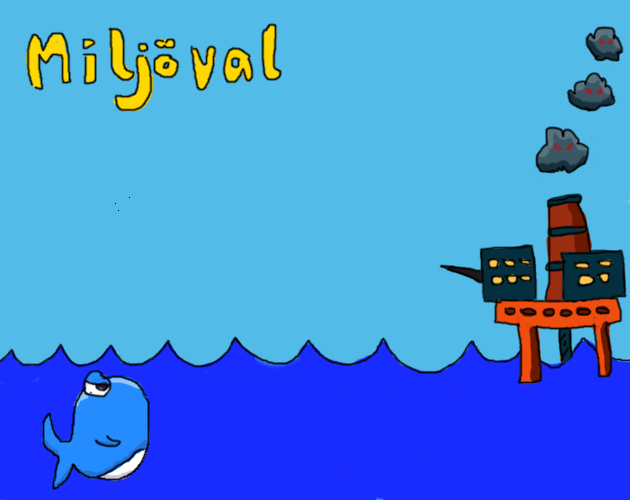

A game made in ~2 weeks, with about 1-2 hours/day (so you can live a life while making the game) for the [kodsnack](https://kodsnack.se/) gamejam [spelsylt number 7](https://itch.io/jam/spelsylt7)

Missing some whale upgrades, sounds, juice and a scoring.

## play

https://madeso.itch.io/miljoval

## time spent

day |       |  | h | |
----|-------|-----|---|----
01  |  4/10 | tue | 1 | design
02  |  5/10 | wed | 0 | 
03  |  6/10 | thu | 0 | 
04  |  7/10 | fri | 0 | 
05  |  8/10 | sat | 0 | 
05  |  9/10 | sun | 0 | 
05  | 10/10 | mon | 2 | godot project, basic gameplay, basic art 
06  | 11/10 | tue | 1 | touch input
07  | 12/10 | wed | 0 |
08  | 13/10 | thu | 0 |
09  | 14/10 | fri | 0 |
10  | 15/10 | sat | 0 |
11  | 16/10 | sun | 0 |
12  | 17/10 | mon | 0 |
13  | 19/10 | tue | 2 | art
14  | 19/10 | wed | 2 | art
15  | 20/10 | thu | 2 | art
16  | 21/10 | fri | 3 | implemented most of the gameplay and scene transitions
17  | 22/10 | sat | 4 | tweaking and some wiggle juice
&nbsp;|     |  | **17** | 

## Game design

