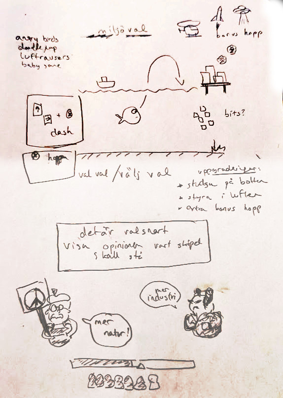

# spelsylt 7: miljöval

dag  1 -  4/10 - 1h - speldesign
dag  2 -  5/10 - 0h - nop
dag  3 -  6/10 - 0h - nop
dag  4 -  7/10 - 0h - nop
dag  5 -  8/10 - 0h - nop
dag  5 -  9/10 - 0h - nop
dag  5 - 10/10 - 2h - godot project, basic gameplay, basic art 

dag  6 - 11/10 - 0h
dag  7 - 12/10 - 0h
dag  8 - 13/10 - 0h
dag  9 - 14/10 - 0h
dag 10 - 15/10 - 0h
dag 11 - 16/10 - 0h
dag 12 - 17/10 - 0h
dag 13 - 19/10 - 0h
dag 14 - 19/10 - 0h
dag 15 - 20/10 - 0h
dag 16 - 21/10 - 0h
dag 17 - 22/10 - 0h

